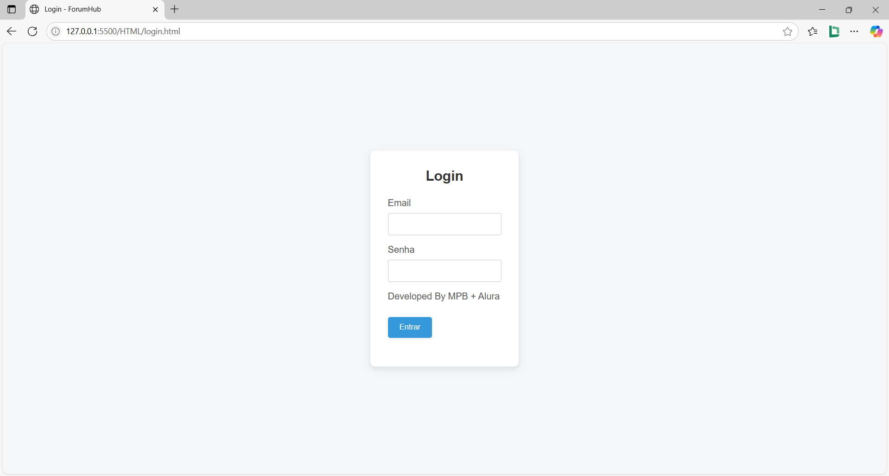
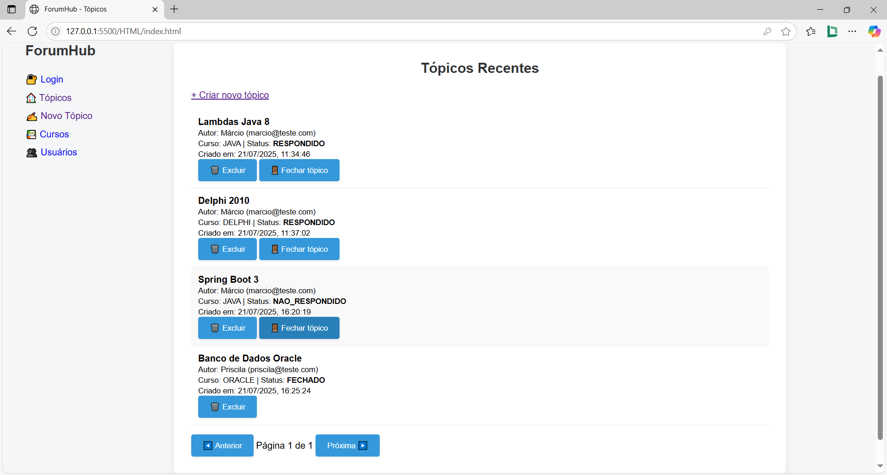
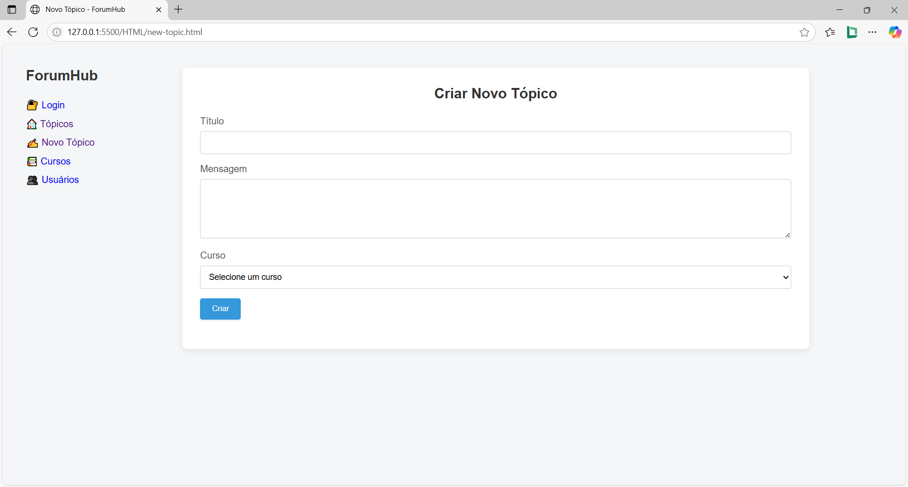
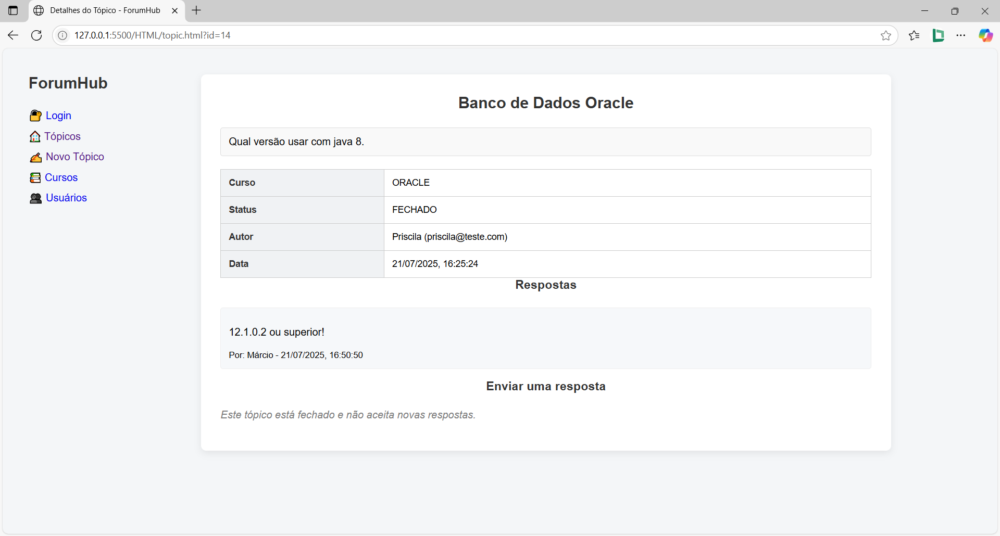
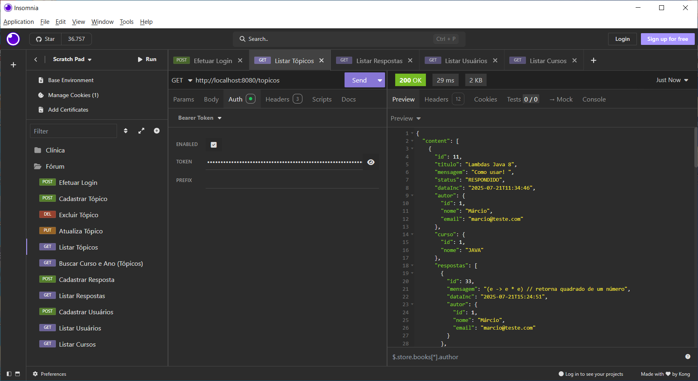

# 📚 ForumHub API


ForumHub é uma API REST desenvolvida com **Spring Boot** para gerenciamento de tópicos, respostas, usuários e cursos em um fórum acadêmico.

## 🚀 Tecnologias

- Java 17+
- Spring Boot
- Spring Security (JWT)
- Spring Data JPA
- Flyway (Migrations)
- MySQL
- Swagger/OpenAPI

## 🔐 Autenticação

- JWT com roles: `ROLE_USER` e `ROLE_ADMIN`
- Controle de acesso por endpoint
- Swagger liberado para testes públicos

## 📘 Endpoints

### Tópicos (`/topicos`)
- Listar, buscar, cadastrar, atualizar, excluir
- Responder a tópicos

### Respostas (`/respostas`)
- Listar e cadastrar respostas

### Usuários (`/usuarios`)
- Listar, cadastrar e excluir usuários

### Cursos (`/cursos`)
- Listar, cadastrar e excluir cursos

## 🗃️ Banco de Dados (MySQL)

### Estrutura

- `cursos(id, nome)`
- `usuarios(id, nome, email, senha, role)`
- `topicos(id, titulo, mensagem, data_inc, status, autor_id, curso_id)`
- `respostas(id, topico_id, data_inc, autor_id, mensagem)`

### Migrations

- Gerenciadas via Flyway, aplicadas automaticamente na inicialização.

## ⚙️ Configuração e Execução

Siga os passos abaixo para rodar o projeto localmente:

### 1. Clone o repositório
```bash
git clone https://github.com/mpbmarcio/challenge-forum-hub
cd forumhub
```

### 2. Configure o banco de dados MySQL
   Crie um banco chamado forum_hub no MySQL e ajuste as credenciais no arquivo .env ou diretamente no application.properties:

```properties
spring.datasource.url=jdbc:mysql://localhost:3306/forum_hub
spring.datasource.username=root
spring.datasource.password=${DB_MYSQL_PASSWORD}
api.security.token.secret=${JWT_TOKEN}
```
Nota: As migrations serão aplicadas automaticamente via Flyway na inicialização.

## 📄 Documentação

Acesse via Swagger:
http://localhost:8080/swagger-ui/index.html

## 📤 Exemplo de Payload — Criação de Tópico

```json
{
  "titulo": "Dúvida sobre Spring Security",
  "mensagem": "Como configurar roles no Spring Boot?",
  "status": "NAO_RESPONDIDO",
  "dataInc": "2024-07-22T10:30:00",
  "autor": {
    "id": 1
  },
  "curso": {
    "id": 2,
    "nome": "Java Backend"
  }
}
```

## 💻 Frontend

O projeto inclui um frontend extra desenvolvido com **HTML**, **CSS** e **JavaScript**, localizado na pasta `front` na raiz do projeto.

Esse frontend consome os endpoints da API e oferece uma interface simples para testes e demonstração visual. Embora não tenha sido exigido no projeto de conclusão, foi implementado como diferencial.

## 🖼️ Demonstração Visual

Abaixo estão algumas telas do frontend desenvolvido para consumir a API:

- Tela de Login
- Página de listagem de tópicos
- Formulário de criação de novo tópico
- Visualização de respostas
- Tela de funcionamento pelo Insomnia







## 👤 Autor

Desenvolvido por [Márcio](https://www.linkedin.com/in/mpbmarcio-dev/) — Desenvolvedor Backend  
Este projeto foi realizado como parte do programa **Alura + Oracle Next Education (ONE)**.  
GitHub: [@mpbmarcio](https://github.com/mpbmarcio) • LinkedIn: [mpbmarcio-dev](https://www.linkedin.com/in/mpbmarcio-dev/)


## Agradecimentos Especiais:

[](https://www.alura.com.br/)
[](https://www.oracle.com/br/education/oracle-next-education/)